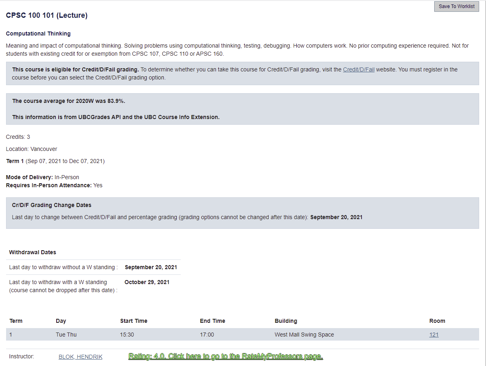
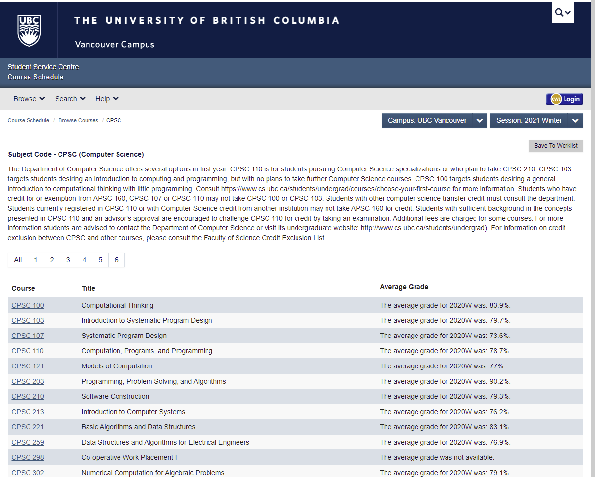
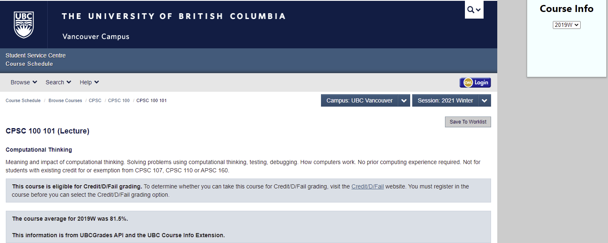

# UBC Vancouver Course Info Chrome Extension

A Chrome extension that adds previous year course averages and current session average professor ratings (see usage for caveats) to the course selection screen on UBC's website to help students pick courses.

 

Change the session (defaults to 2020W) using the Chrome extension button.

### General Usage

 - Clone the files and upload whole folder into your Chromium-based browser or [download it from the Chrome App Store](https://chrome.google.com/webstore/detail/course-info/aopmgfpchahgejjdcddfmonhnogcignk).

### Setting up your own environment:

 - As of 2022, there are changes to the RateMyProf website such that the ratings are not served up statically. To get ratings, you need to install all dependencies and run the web scraper API in /scraper with `flask start`

Dependencies to install:
- `pip install flask`
- `pip install selenium`
- `pip install sqlalchemy`
- `pip install flask_cors`
- You also need to add chromium driver executable to your PATH. I used the driver from chromium version 100 (https://chromedriver.chromium.org/downloads)

